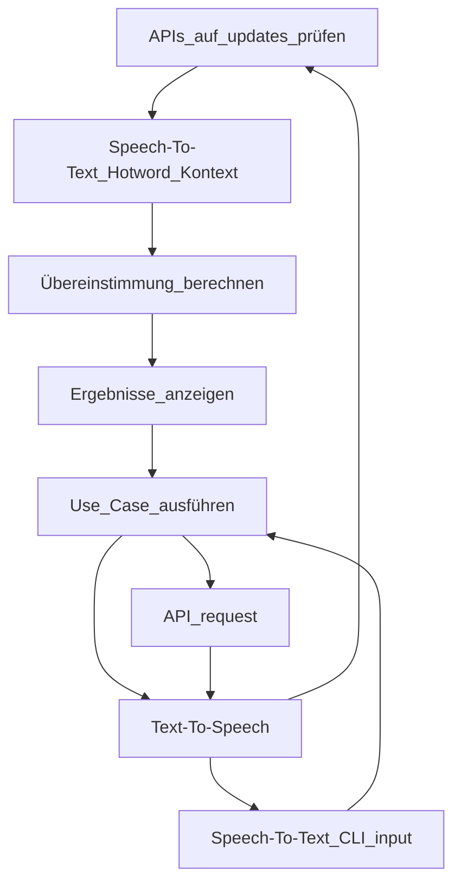

<h1 align="center">
 Marcell J'Arvis
</h1>

<h4 align="center">
 A speech bot for your daily needs build during advanced software engineering at DHBW Stuttgart.
</h4>

<div align="center">
 <a href="https://www.python.org/downloads/release/python-3100/">
  
 </a>
 <a href="https://github.com/psf/black">
  
 </a>
 <a href="https://github.com/prettier/prettier">
  
 </a>
 <a href="https://github.com/pre-commit/pre-commit">
  
 </a>
 <a href="https://github.com/felixhoffmnn/python_template">
  
 </a>
</div>
<br>

<!-- TODO: Edit paragraph -->

This project was built by a team of 5 students during the advanced software engineering course at [DHBW Stuttgart](https://www.dhbw-stuttgart.de/). The goal was to create a bot that can interact using speech-to-text and text-to-speech with the user and perform tasks like a morning briefing, a helper for planning trips and events, and also to provide information about current sports events.

## :rocket: Requirements & Usage

> :arrow_up: Python 3.10 is required

Following dependencies are listed which are required to either run or contribute to this project.

1. Install `portaudio` for speech recognition:

-   On macOS: `brew install portaudio`
-   On Linux: `sudo apt install python-pyaudio python3-pyaudio`

2. Install [Poetry](https://python-poetry.org/docs/#installation)

-   Poetry is a dependency manager for Python used in this project
-   (Optional) Setup poetry to use the local `.venv` folder by running `poetry config virtualenvs.in-project true`

3. Run `poetry install` to install all dependencies

-   Afterwards, run `poetry shell` to activate the virtual environment

4. Install the pre-commit hooks with `poetry run pre-commit install`

<br>

After the setup is complete, use the **following commands** to run the agent. Note that you need to be in the **root directory** of the project.

```bash
poetry run python aswe/core/agent.py --get_mic --get_user agent
```

## :speech_balloon: Concept

In the following section we will go into detail about the concept of the agent. The agent is divided into three main parts: the **speech** and **text conversion**, the **agent**, the **use cases**, and the **API layer**.

<!-- TODO: Update mermaid or replace with drawio -->



## :memo: License

This project is licensed under [MIT](https://github.com/felixhoffmnn/aswe/blob/main/LICENSE).
