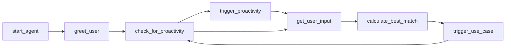

# Core

The core module contains the **Agent**, **STT**, **TTS**, as well as dataclasses related to the **Agent**. The Agent is responsible for the overall control flow of the application. It is the main entry point for the user and the main interface to the other modules. It also takes care of the proactivity of the application.

## Agent

<!-- prettier-ignore -->
::: aswe.core.agent
    options:
        heading_level: 3

## User Interaction

<!-- prettier-ignore -->
::: aswe.core.user_interaction
    options:
        heading_level: 3

## Dataclasses

<!-- prettier-ignore -->
::: aswe.core.objects
    options:
        heading_level: 3
